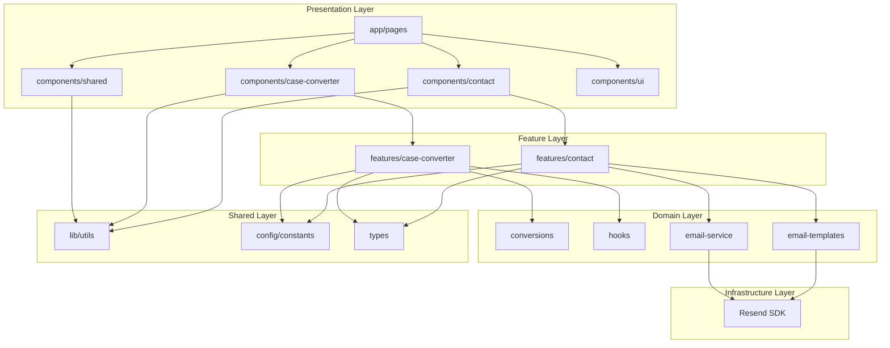

# Refactoring Plan: Clean Code, SOLID, Modular Approach & Next.js Best Practices

## Executive Summary

This document outlines a comprehensive refactoring plan for the Caseify Case Converter application to align with Clean Code principles, SOLID design patterns, modular architecture, and Next.js best practices.

---

## 1. Issues Identified

### 1.1 Clean Code Violations

| Issue | Location | Impact |
|-------|----------|--------|
| Magic strings/numbers | `components/case-converter.tsx:46-50`, `lib/hooks.ts:29` | Hard to maintain, error-prone |
| Long files with multiple components | `components/layout.tsx` (9 components, 248 lines) | Violates SRP, hard to navigate |
| Inconsistent naming | Various files | Reduces code readability |
| Commented code not matching implementation | `components/case-converter.tsx:42` | Confusing for developers |
| Complex nested ternary operators | `components/case-converter.tsx:92` | Reduces readability |
| Repeated code patterns | Icon containers across components | Code duplication |

### 1.2 SOLID Principle Violations

| Principle | Violation | Location |
|-----------|-----------|----------|
| **SRP** | `components/layout.tsx` contains 9 unrelated components | `components/layout.tsx:1-248` |
| **SRP** | `components/case-converter.tsx` has nested components | `components/case-converter.tsx:45-99` |
| **SRP** | `lib/actions.ts` handles email sending AND error handling | `lib/actions.ts:1-56` |
| **OCP** | `CONVERSION_OPTIONS` is hardcoded, not extensible | `components/case-converter.tsx:106-114` |
| **OCP** | Email templates are hardcoded strings | `lib/email-templates.ts:1-181` |
| **ISP** | `TextStats` has unused `sentences` property | `lib/hooks.ts:3-8` |
| **DIP** | Direct dependency on `resend` library | `lib/resend.ts:1-7` |
| **DIP** | No abstractions for email service | `lib/actions.ts:3-4` |

### 1.3 Modular Approach Issues

| Issue | Description |
|-------|-------------|
| No feature-based folder structure | All components in flat `components/` directory |
| Monolithic files | Multiple components in single files |
| Types and constants scattered | No centralized type definitions |
| No clear separation of concerns | UI, logic, and data mixed together |

### 1.4 Next.js Best Practices Violations

| Issue | Location | Best Practice |
|-------|----------|---------------|
| Unnecessary "use client" | `app/privacy/page.tsx:1`, `app/terms/page.tsx:1` | Use Server Components when possible |
| Environment variables with NEXT_PUBLIC_ | `lib/resend.ts:3` | Server secrets should not use NEXT_PUBLIC_ |
| No proper error boundaries | Missing | Implement Error Boundaries |
| No loading states with Suspense | Missing | Implement Suspense boundaries |
| No caching strategies | Server actions | Add revalidate/cache settings |
| No image optimization | Public images used directly | Use next/image component |
| Missing page metadata | Individual pages | Use generateMetadata or metadata export |
| No proper data fetching patterns | Contact form | Consider proper loading/error states |

---

## 2. Proposed Architecture

### 2.1 New Directory Structure

```
caseify-case-converter/
├── app/
│   ├── (marketing)/              # Route group for marketing pages
│   │   ├── layout.tsx            # Marketing layout
│   │   ├── page.tsx              # Home (case converter)
│   │   ├── privacy/
│   │   │   └── page.tsx
│   │   └── terms/
│   │       └── page.tsx
│   ├── contact/
│   │   ├── page.tsx
│   │   └── loading.tsx           # Loading state
│   ├── error.tsx
│   ├── not-found.tsx
│   ├── layout.tsx
│   └── globals.css
├── components/
│   ├── shared/                   # Shared UI components
│   │   ├── logo.tsx
│   │   ├── header.tsx
│   │   ├── footer.tsx
│   │   ├── page-layout.tsx
│   │   ├── page-header.tsx
│   │   ├── info-card.tsx
│   │   ├── info-grid.tsx
│   │   ├── page-section.tsx
│   │   └── content-card.tsx
│   ├── case-converter/           # Feature: Case Converter
│   │   ├── index.tsx             # Main component
│   │   ├── stat-badge.tsx
│   │   ├── icon-button.tsx
│   │   ├── conversion-grid.tsx
│   │   └── text-area.tsx
│   ├── contact/                  # Feature: Contact Form
│   │   ├── contact-form.tsx
│   │   ├── contact-info.tsx
│   │   └── success-message.tsx
│   ├── ui/                       # Shadcn UI components
│   │   ├── badge.tsx
│   │   ├── button.tsx
│   │   ├── card.tsx
│   │   ├── input.tsx
│   │   ├── label.tsx
│   │   ├── textarea.tsx
│   │   └── tooltip.tsx
│   ├── mode-toggle.tsx
│   └── theme-provider.tsx
├── features/                     # Feature modules
│   ├── case-converter/
│   │   ├── hooks/
│   │   │   └── use-case-converter.ts
│   │   ├── types/
│   │   │   └── conversion.types.ts
│   │   └── constants/
│   │       └── conversion-options.ts
│   ├── contact/
│   │   ├── actions/
│   │   │   └── send-email.server.ts
│   │   ├── types/
│   │   │   └── contact.types.ts
│   │   └── constants/
│   │       └── social-links.ts
│   └── email/
│       ├── services/
│       │   ├── email-service.interface.ts
│       │   └── resend-email.service.ts
│       └── templates/
│           ├── contact-email.template.ts
│           └── confirmation-email.template.ts
├── lib/
│   ├── conversions.ts            # → Move to features/case-converter/
│   ├── utils.ts
│   └── hooks.ts                  # → Move to features/case-converter/hooks/
├── config/
│   ├── constants.ts              # App-wide constants
│   └── environment.ts            # Environment validation
├── types/
│   └── index.ts                  # Shared types
└── plans/
    ├── refactoring-plan.md
    ├── ui-redesign-plan.md
    └── ui-mockups.md
```

### 2.2 Architecture Diagram



---

## 3. Detailed Refactoring Tasks

### 3.1 Phase 1: Structure & Organization

#### Task 1.1: Create New Directory Structure
- [ ] Create `components/shared/` directory
- [ ] Create `components/case-converter/` directory
- [ ] Create `components/contact/` directory
- [ ] Create `features/` directory with subdirectories
- [ ] Create `config/` directory
- [ ] Create `types/` directory

#### Task 1.2: Extract Components from layout.tsx
Move each component to its own file:
- [ ] `components/shared/logo.tsx`
- [ ] `components/shared/header.tsx`
- [ ] `components/shared/footer.tsx`
- [ ] `components/shared/page-layout.tsx`
- [ ] `components/shared/page-header.tsx`
- [ ] `components/shared/info-card.tsx`
- [ ] `components/shared/info-grid.tsx`
- [ ] `components/shared/page-section.tsx`
- [ ] `components/shared/content-card.tsx`

#### Task 1.3: Extract Components from case-converter.tsx
- [ ] `components/case-converter/stat-badge.tsx`
- [ ] `components/case-converter/icon-button.tsx`
- [ ] `components/case-converter/conversion-grid.tsx`
- [ ] `components/case-converter/text-area.tsx`

#### Task 1.4: Create Contact Feature Components
- [ ] `components/contact/contact-form.tsx`
- [ ] `components/contact/contact-info.tsx`
- [ ] `components/contact/success-message.tsx`

### 3.2 Phase 2: SOLID Principles Implementation

#### Task 2.1: Single Responsibility Principle (SRP)
- [ ] Split `lib/actions.ts` into separate files
- [ ] Create `features/contact/actions/send-email.server.ts`
- [ ] Create separate validation functions
- [ ] Extract error handling to utility

#### Task 2.2: Open/Closed Principle (OCP)
- [ ] Create `features/case-converter/types/conversion.types.ts` with interfaces
- [ ] Create `features/case-converter/constants/conversion-options.ts`
- [ ] Make conversion options extensible via configuration
- [ ] Create email template builder pattern

#### Task 2.3: Interface Segregation Principle (ISP)
- [ ] Remove unused `sentences` from `TextStats` or create separate interfaces
- [ ] Create smaller, focused interfaces for email service

#### Task 2.4: Dependency Inversion Principle (DIP)
- [ ] Create `features/email/services/email-service.interface.ts`
- [ ] Create `features/email/services/resend-email.service.ts` implementing interface
- [ ] Inject dependencies via factory pattern

### 3.3 Phase 3: Clean Code Improvements

#### Task 3.1: Extract Magic Strings/Numbers
- [ ] Create `config/constants.ts` with:
  - `COPY_FEEDBACK_DURATION = 2000`
  - `STAT_COLORS` mapping
  - `DOWNLOAD_FILENAME = "converted-text.txt"`
  - Email-related constants
- [ ] Replace all magic values with constants

#### Task 3.2: Improve Naming Conventions
- [ ] Ensure all functions use verb-noun pattern
- [ ] Ensure all components use PascalCase
- [ ] Ensure all constants use UPPER_SNAKE_CASE
- [ ] Ensure all interfaces use PascalCase with `I` prefix (or consistent style)

#### Task 3.3: Reduce Code Duplication
- [ ] Create `components/shared/icon-container.tsx` for repeated icon patterns
- [ ] Extract common button styles to variants
- [ ] Create utility functions for repeated logic

#### Task 3.4: Improve Function Complexity
- [ ] Break down `useCaseConverter` hook into smaller hooks
- [ ] Simplify nested ternary operators
- [ ] Extract complex inline logic to named functions

### 3.4 Phase 4: Next.js Best Practices

#### Task 4.1: Server Components Optimization
- [ ] Convert `app/privacy/page.tsx` to Server Component
- [ ] Convert `app/terms/page.tsx` to Server Component
- [ ] Keep only necessary "use client" directives
- [ ] Extract client components from server pages

#### Task 4.2: Environment Variables
- [ ] Change `NEXT_PUBLIC_RESEND_API_KEY` to `RESEND_API_KEY`
- [ ] Create `config/environment.ts` with validation
- [ ] Add `.env.example` documentation

#### Task 4.3: Error Handling
- [ ] Create global error boundary component
- [ ] Improve error.tsx with better error categorization
- [ ] Add error logging service interface

#### Task 4.4: Loading States
- [ ] Create `app/contact/loading.tsx`
- [ ] Add Suspense boundaries where needed
- [ ] Create skeleton components for loading states

#### Task 4.5: Metadata
- [ ] Add `generateMetadata` to individual pages
- [ ] Create metadata utility functions
- [ ] Add Open Graph and Twitter Card metadata

#### Task 4.6: Caching Strategies
- [ ] Add `revalidate` to server actions
- [ ] Implement proper cache tags for data
- [ ] Add cache invalidation strategies

#### Task 4.7: Image Optimization
- [ ] Replace `` with `next/image` where applicable
- [ ] Add proper image dimensions
- [ ] Configure image domains in next.config.ts

### 3.5 Phase 5: Type Safety & Documentation

#### Task 5.1: Centralize Types
- [ ] Create `types/index.ts` with shared types
- [ ] Move component-specific types to feature directories
- [ ] Ensure all functions have proper return types

#### Task 5.2: Add JSDoc Comments
- [ ] Document all public functions
- [ ] Add parameter descriptions
- [ ] Add return value descriptions
- [ ] Add usage examples for complex functions

#### Task 5.3: Create README for Features
- [ ] Document case-converter feature
- [ ] Document contact feature
- [ ] Document email service

---

## 4. Implementation Order

### Priority 1: High Impact, Low Risk
1. Extract constants from magic strings/numbers
2. Create directory structure
3. Split layout.tsx into separate files
4. Convert static pages to Server Components

### Priority 2: Medium Impact, Medium Risk
5. Extract components from case-converter.tsx
6. Implement email service interface (DIP)
7. Create config/environment.ts
8. Add metadata to pages

### Priority 3: Lower Impact, Higher Risk
9. Refactor useCaseConverter hook
10. Implement loading states with Suspense
11. Create error boundary improvements
12. Add image optimization

---

## 5. Code Examples

### 5.1 Before: Magic Numbers
```typescript
// components/case-converter.tsx
setTimeout(() => setCopied(false), 2000);
```

### 5.2 After: Constants
```typescript
// config/constants.ts
export const COPY_FEEDBACK_DURATION = 2000;

// components/case-converter/stat-badge.tsx
import { COPY_FEEDBACK_DURATION } from "@/config/constants";
setTimeout(() => setCopied(false), COPY_FEEDBACK_DURATION);
```

### 5.3 Before: Violating SRP
```typescript
// lib/actions.ts - handles email sending AND error handling
export async function sendEmail(formData: FormData) {
    // validation
    // email sending
    // error handling
    // confirmation email
}
```

### 5.4 After: SRP Compliant
```typescript
// features/contact/actions/send-email.server.ts
export async function sendEmail(formData: FormData) {
    const validatedData = validateContactForm(formData);
    return await emailService.sendContactEmail(validatedData);
}

// features/contact/actions/validate-contact-form.ts
export function validateContactForm(formData: FormData) {
    // validation logic
}

// features/email/services/email-service.interface.ts
export interface IEmailService {
    sendContactEmail(data: ContactFormData): Promise<EmailResult>;
    sendConfirmationEmail(email: string): Promise<void>;
}
```

### 5.5 Before: Hardcoded Options (OCP Violation)
```typescript
// components/case-converter.tsx
const CONVERSION_OPTIONS = [
    { label: "Sentence case", fn: toSentenceCase },
    { label: "lower case", fn: toLowerCase },
    // ...
];
```

### 5.6 After: Extensible Configuration
```typescript
// features/case-converter/types/conversion.types.ts
export interface ConversionOption {
    id: string;
    label: string;
    fn: (text: string) => string;
    category?: ConversionCategory;
}

// features/case-converter/constants/conversion-options.ts
import { ConversionOption } from "../types/conversion.types";

export const CONVERSION_OPTIONS: ConversionOption[] = [
    {
        id: "sentence-case",
        label: "Sentence case",
        fn: toSentenceCase,
        category: "basic"
    },
    // ...
];

// Easy to extend:
export const CUSTOM_CONVERSIONS: ConversionOption[] = [
    // User-defined conversions
];
```

### 5.7 Before: Direct Dependency (DIP Violation)
```typescript
// lib/resend.ts
import { Resend } from "resend";
export const resend = new Resend(process.env.NEXT_PUBLIC_RESEND_API_KEY);

// lib/actions.ts
import { resend } from "@/lib/resend";
await resend.emails.send({...});
```

### 5.8 After: Dependency Inversion
```typescript
// features/email/services/email-service.interface.ts
export interface IEmailService {
    sendEmail(params: EmailParams): Promise<EmailResult>;
}

// features/email/services/resend-email.service.ts
import { Resend } from "resend";
import { IEmailService } from "./email-service.interface";

export class ResendEmailService implements IEmailService {
    private client: Resend;
    
    constructor(apiKey: string) {
        this.client = new Resend(apiKey);
    }
    
    async sendEmail(params: EmailParams): Promise<EmailResult> {
        // implementation
    }
}

// features/email/services/email-service.factory.ts
import { IEmailService } from "./email-service.interface";
import { ResendEmailService } from "./resend-email.service";

export function createEmailService(): IEmailService {
    const apiKey = process.env.RESEND_API_KEY;
    if (!apiKey) throw new Error("RESEND_API_KEY is required");
    return new ResendEmailService(apiKey);
}

// Usage
import { createEmailService } from "@/features/email/services/email-service.factory";
const emailService = createEmailService();
await emailService.sendEmail({...});
```

### 5.9 Before: Unnecessary Client Component
```typescript
// app/privacy/page.tsx
"use client";

export default function PrivacyPage() {
    return (
        <PageLayout>
            {/* static content */}
        </PageLayout>
    );
}
```

### 5.10 After: Server Component
```typescript
// app/privacy/page.tsx
// No "use client" directive - this is a Server Component

import { PageLayout } from "@/components/shared/page-layout";

export const metadata = {
    title: "Privacy Policy - Convert Case",
    description: "Your privacy is our top priority...",
};

export default function PrivacyPage() {
    return (
        <PageLayout>
            {/* static content */}
        </PageLayout>
    );
}
```

---

## 6. Testing Strategy

### 6.1 Unit Tests
- [ ] Test conversion functions
- [ ] Test text statistics calculation
- [ ] Test form validation
- [ ] Test email service interface

### 6.2 Integration Tests
- [ ] Test contact form submission
- [ ] Test email sending flow
- [ ] Test error handling

### 6.3 E2E Tests
- [ ] Test case conversion workflow
- [ ] Test copy/download functionality
- [ ] Test contact form submission

---

## 7. Migration Checklist

### Pre-Migration
- [ ] Create backup branch
- [ ] Run full test suite (if exists)
- [ ] Document current behavior

### During Migration
- [ ] Migrate one component at a time
- [ ] Run tests after each change
- [ ] Verify functionality manually

### Post-Migration
- [ ] Run full test suite
- [ ] Perform manual QA
- [ ] Update documentation
- [ ] Create PR for review

---

## 8. Success Criteria

- [ ] All components follow Single Responsibility Principle
- [ ] No magic strings or numbers in code
- [ ] All static pages are Server Components
- [ ] Environment variables properly configured
- [ ] Email service follows Dependency Inversion
- [ ] Conversion options are extensible
- [ ] Code is organized by feature
- [ ] All types are properly defined
- [ ] Code has consistent naming conventions
- [ ] Public functions have JSDoc comments
- [ ] No code duplication above threshold
- [ ] All pages have proper metadata

---

## 9. Estimated Complexity

| Phase | Complexity | Risk Level |
|-------|-----------|------------|
| Phase 1: Structure | Medium | Low |
| Phase 2: SOLID | High | Medium |
| Phase 3: Clean Code | Medium | Low |
| Phase 4: Next.js Best Practices | High | Medium |
| Phase 5: Type Safety | Low | Low |

---

## 10. Notes

- This refactoring should be done incrementally
- Each phase can be completed independently
- Focus on maintaining existing functionality while improving code quality
- Consider using ESLint and Prettier to enforce standards
- Add Husky pre-commit hooks for code quality checks
