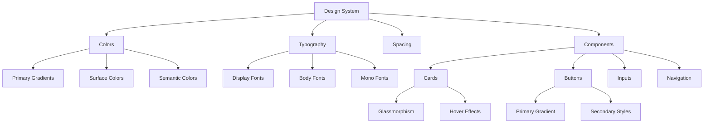

# Caseify UI/UX Redesign Plan

## Design Philosophy

**Vision:** Create a clean, modern, and minimalist interface that feels confident and premium while maintaining excellent usability.

**Core Principles:**
- **Minimalist with Purpose:** Every element serves a function
- **Confident Gradients:** Bold, vibrant gradients that guide attention
- **Sophisticated Grids:** Elegant background patterns that add depth
- **Micro-interactions:** Smooth, delightful animations
- **Glassmorphism:** Subtle blur effects for depth and modernity
- **Accessibility First:** High contrast, clear hierarchy

---

## 1. Color System Redesign

### Primary Color Palette (Confident & Vibrant)

**Light Mode:**
```css
--primary: oklch(0.55 0.22 280);       /* Vibrant purple-blue */
--primary-light: oklch(0.70 0.18 280); /* Lighter accent */
--primary-dark: oklch(0.40 0.25 280);  /* Deep accent */
--accent: oklch(0.65 0.20 40);         /* Warm amber */
--accent-secondary: oklch(0.60 0.18 170); /* Teal green */
--gradient-1: linear-gradient(135deg, oklch(0.55 0.22 280), oklch(0.60 0.18 170));
--gradient-2: linear-gradient(135deg, oklch(0.65 0.20 40), oklch(0.55 0.22 280));
```

**Dark Mode:**
```css
--primary: oklch(0.70 0.20 280);      /* Bright purple-blue */
--primary-light: oklch(0.80 0.15 280); /* Light accent */
--primary-dark: oklch(0.55 0.25 280);  /* Deep accent */
--accent: oklch(0.75 0.18 40);         /* Bright amber */
--accent-secondary: oklch(0.70 0.16 170); /* Bright teal */
--gradient-1: linear-gradient(135deg, oklch(0.70 0.20 280), oklch(0.75 0.16 170));
--gradient-2: linear-gradient(135deg, oklch(0.75 0.18 40), oklch(0.70 0.20 280));
```

### Surface Colors (Glassmorphism)
```css
--glass-bg: oklch(0.98 0.005 240 / 0.7);      /* Light glass */
--glass-border: oklch(0.80 0.02 240 / 0.3);
--glass-shadow: 0 8px 32px oklch(0.40 0.02 240 / 0.1);
```

---

## 2. Typography System

### Font Hierarchy
```css
--font-display: 'Inter', system-ui, sans-serif;  /* For headings */
--font-body: 'Inter', system-ui, sans-serif;   /* For body text */
--font-mono: 'JetBrains Mono', monospace;       /* For code/stats */

/* Display Sizes */
--text-4xl: 3.5rem;      /* Hero titles */
--text-3xl: 2.5rem;      /* Page titles */
--text-2xl: 2rem;        /* Section titles */
--text-xl: 1.25rem;      /* Card titles */
--text-lg: 1.125rem;     /* Body large */
--text-base: 1rem;       /* Body default */
--text-sm: 0.875rem;     /* Small text */
--text-xs: 0.75rem;      /* Labels */
```

### Font Weights
```css
--font-bold: 700;        /* Emphasis */
--font-semibold: 600;    /* Subheadings */
--font-medium: 500;      /* Body emphasis */
--font-regular: 400;     /* Default */
```

---

## 3. Background Grids & Patterns

### Primary Grid Pattern (Isometric)
```css
.isometric-grid {
  background-image: 
    linear-gradient(30deg, oklch(0.40 0.02 240 / 0.03) 12%, transparent 12.5%, transparent 87%, oklch(0.40 0.02 240 / 0.03) 87.5%, oklch(0.40 0.02 240 / 0.03)),
    linear-gradient(150deg, oklch(0.40 0.02 240 / 0.03) 12%, transparent 12.5%, transparent 87%, oklch(0.40 0.02 240 / 0.03) 87.5%, oklch(0.40 0.02 240 / 0.03)),
    linear-gradient(30deg, oklch(0.40 0.02 240 / 0.03) 12%, transparent 12.5%, transparent 87%, oklch(0.40 0.02 240 / 0.03) 87.5%, oklch(0.40 0.02 240 / 0.03)),
    linear-gradient(150deg, oklch(0.40 0.02 240 / 0.03) 12%, transparent 12.5%, transparent 87%, oklch(0.40 0.02 240 / 0.03) 87.5%, oklch(0.40 0.02 240 / 0.03));
  background-size: 80px 140px;
  background-position: 0 0, 0 0, 40px 70px, 40px 70px;
}
```

### Dot Grid Pattern
```css
.dot-grid {
  background-image: radial-gradient(oklch(0.40 0.02 240 / 0.15) 1px, transparent 1px);
  background-size: 32px 32px;
}
```

### Mesh Gradient Background
```css
.mesh-gradient {
  background: 
    radial-gradient(at 0% 0%, oklch(0.55 0.22 280 / 0.15) 0px, transparent 50%),
    radial-gradient(at 100% 0%, oklch(0.65 0.20 40 / 0.15) 0px, transparent 50%),
    radial-gradient(at 100% 100%, oklch(0.60 0.18 170 / 0.15) 0px, transparent 50%),
    radial-gradient(at 0% 100%, oklch(0.55 0.22 280 / 0.15) 0px, transparent 50%);
}
```

---

## 4. Component Redesign Specifications

### 4.1 Cards (Glassmorphism)
```css
.glass-card {
  background: var(--glass-bg);
  backdrop-filter: blur(20px);
  -webkit-backdrop-filter: blur(20px);
  border: 1px solid var(--glass-border);
  border-radius: 24px;
  box-shadow: var(--glass-shadow);
  transition: all 0.3s cubic-bezier(0.4, 0, 0.2, 1);
}

.glass-card:hover {
  transform: translateY(-4px);
  box-shadow: 0 20px 40px oklch(0.40 0.02 240 / 0.15);
  border-color: oklch(0.55 0.22 280 / 0.3);
}
```

### 4.2 Buttons (Confident Gradients)
```css
.btn-primary {
  background: var(--gradient-1);
  color: white;
  border-radius: 16px;
  padding: 14px 28px;
  font-weight: 600;
  font-size: 1rem;
  box-shadow: 0 4px 20px oklch(0.55 0.22 280 / 0.3);
  transition: all 0.3s cubic-bezier(0.4, 0, 0.2, 1);
}

.btn-primary:hover {
  transform: translateY(-2px) scale(1.02);
  box-shadow: 0 8px 30px oklch(0.55 0.22 280 / 0.4);
}

.btn-primary:active {
  transform: translateY(0) scale(0.98);
}
```

### 4.3 Input Fields (Modern & Clean)
```css
.input-modern {
  background: oklch(0.98 0.005 240 / 0.5);
  border: 2px solid oklch(0.80 0.02 240 / 0.5);
  border-radius: 16px;
  padding: 16px 20px;
  font-size: 1rem;
  transition: all 0.3s ease;
}

.input-modern:focus {
  outline: none;
  border-color: oklch(0.55 0.22 280);
  box-shadow: 0 0 0 4px oklch(0.55 0.22 280 / 0.1);
}
```

### 4.4 Textarea (Editor Style)
```css
.textarea-editor {
  background: oklch(0.99 0.005 240);
  border: none;
  border-radius: 24px;
  padding: 32px;
  font-size: 1.125rem;
  line-height: 1.8;
  box-shadow: 
    0 4px 20px oklch(0.40 0.02 240 / 0.05),
    inset 0 1px 0 oklch(0.40 0.02 240 / 0.05);
}
```

---

## 5. Page-Specific Redesigns

### 5.1 Home Page (Case Converter)

**Hero Section:**
- Large gradient title with subtle animation
- Floating 3D-style case conversion preview
- Animated gradient border on main card

**Main Converter Card:**
- Glassmorphism design with gradient border
- Floating action buttons with hover lift
- Real-time stats with animated counters
- Gradient conversion buttons with icons

**Feature Cards:**
- 3-column grid with hover reveal animations
- Gradient icon backgrounds
- Subtle parallax effect on scroll

**Visual Flow:**
```
┌─────────────────────────────────────────┐
│  [Logo]                    [Theme][GitHub]│
├─────────────────────────────────────────┤
│                                         │
│    Smart Case Converter                 │
│    Modern text transformation tools     │
│                                         │
│  ┌─────────────────────────────────┐   │
│  │                                 │   │
│  │   [Type or paste text...]       │   │
│  │                                 │   │
│  │  📊 1,234 chars  📝 45 words   │   │
│  │                                 │   │
│  │  [📋] [💾] [🗑️]                 │   │
│  └─────────────────────────────────┘   │
│                                         │
│  [Sentence] [lower] [UPPER] [Capital]  │
│  [Alternating] [Title] [Inverse]       │
│                                         │
│  ┌──────────┐ ┌──────────┐ ┌──────────┐│
│  │ ⚡ Fast  │ │ 🎨 Modern│ │ 🔒 Secure││
│  └──────────┘ └──────────┘ └──────────┘│
│                                         │
└─────────────────────────────────────────┘
```

### 5.2 Contact Page

**Layout:**
- Split screen design (40% info, 60% form)
- Animated gradient border on form card
- Floating contact info cards with icons
- Success state with confetti animation

**Form Design:**
- Glassmorphism inputs with floating labels
- Gradient submit button with loading state
- Real-time validation with smooth animations

### 5.3 Privacy & Terms Pages

**Structure:**
- Hero with gradient icon
- Feature cards at top
- Accordion-style content sections
- Smooth scroll navigation

**Visual Elements:**
- Gradient section dividers
- Icon-enhanced headers
- Subtle hover effects on sections

### 5.4 Error Pages (404, 500)

**404 Page:**
- Large animated "404" with gradient
- Floating case conversion theme
- Playful copy with case puns
- Animated search icon

**500 Page:**
- Glitch effect on error number
- Gradient warning icon
- Calming color scheme
- Clear recovery actions

---

## 6. Animation System

### Key Animations

**Fade In Up:**
```css
@keyframes fadeInUp {
  from {
    opacity: 0;
    transform: translateY(30px);
  }
  to {
    opacity: 1;
    transform: translateY(0);
  }
}
```

**Gradient Shift:**
```css
@keyframes gradientShift {
  0%, 100% { background-position: 0% 50%; }
  50% { background-position: 100% 50%; }
}
```

**Float:**
```css
@keyframes float {
  0%, 100% { transform: translateY(0); }
  50% { transform: translateY(-10px); }
}
```

**Pulse Glow:**
```css
@keyframes pulseGlow {
  0%, 100% { box-shadow: 0 0 20px oklch(0.55 0.22 280 / 0.3); }
  50% { box-shadow: 0 0 40px oklch(0.55 0.22 280 / 0.5); }
}
```

---

## 7. Responsive Design

### Breakpoints
```css
--mobile: 640px;
--tablet: 768px;
--desktop: 1024px;
--wide: 1280px;
```

### Mobile Adaptations
- Stacked layouts
- Larger touch targets (44px minimum)
- Simplified animations
- Reduced grid complexity

---

## 8. Accessibility Features

- WCAG AAA color contrast ratios
- Focus states with visible indicators
- Keyboard navigation support
- Screen reader friendly markup
- Reduced motion preferences respected

---

## 9. Implementation Order

1. ✅ Global CSS redesign (colors, typography, animations)
2. ✅ Layout components (Header, Footer, PageLayout)
3. ✅ Home page (Case Converter)
4. ✅ Contact page
5. ✅ Privacy page
6. ✅ Terms page
7. ✅ Error pages (404, 500)
8. ✅ Final review and polish

---

## 10. Design Tokens Summary

### Spacing
```css
--space-xs: 4px;
--space-sm: 8px;
--space-md: 16px;
--space-lg: 24px;
--space-xl: 32px;
--space-2xl: 48px;
--space-3xl: 64px;
--space-4xl: 96px;
```

### Border Radius
```css
--radius-sm: 8px;
--radius-md: 12px;
--radius-lg: 16px;
--radius-xl: 20px;
--radius-2xl: 24px;
--radius-3xl: 32px;
--radius-full: 9999px;
```

### Shadows
```css
--shadow-sm: 0 2px 8px oklch(0.40 0.02 240 / 0.08);
--shadow-md: 0 4px 16px oklch(0.40 0.02 240 / 0.1);
--shadow-lg: 0 8px 32px oklch(0.40 0.02 240 / 0.12);
--shadow-xl: 0 16px 64px oklch(0.40 0.02 240 / 0.15);
--shadow-glow: 0 0 40px oklch(0.55 0.22 280 / 0.3);
```

---

## Visual Mockup Descriptions

### Home Page
- Background: Subtle isometric grid with floating gradient orbs
- Header: Glassmorphism nav with gradient logo
- Hero: Large gradient text with animated underline
- Converter: Glass card with gradient border, floating buttons
- Buttons: Gradient grid with hover lift effects

### Contact Page
- Left panel: Gradient cards with floating icons
- Right panel: Glass form with gradient submit button
- Success: Animated checkmark with confetti

### Error Pages
- Large gradient number with glow effect
- Floating decorative elements
- Clear action buttons with hover states

---

## Design System Diagram



---

## Next Steps

After approval of this plan:
1. Switch to Code mode
2. Implement global CSS changes
3. Redesign each component systematically
4. Test responsive behavior
5. Polish animations and micro-interactions
